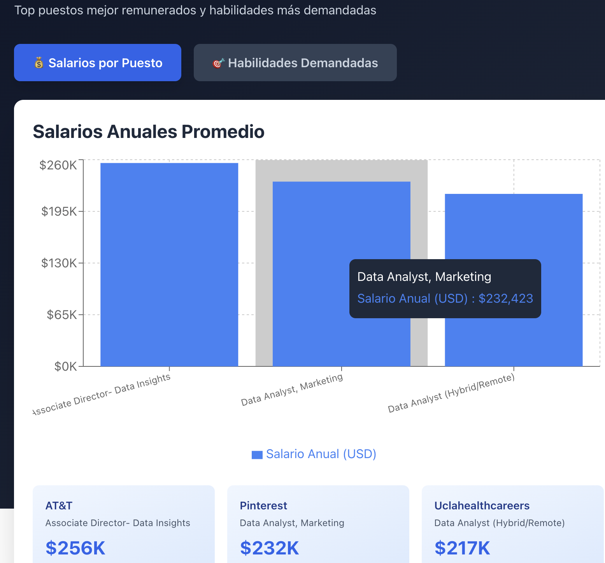
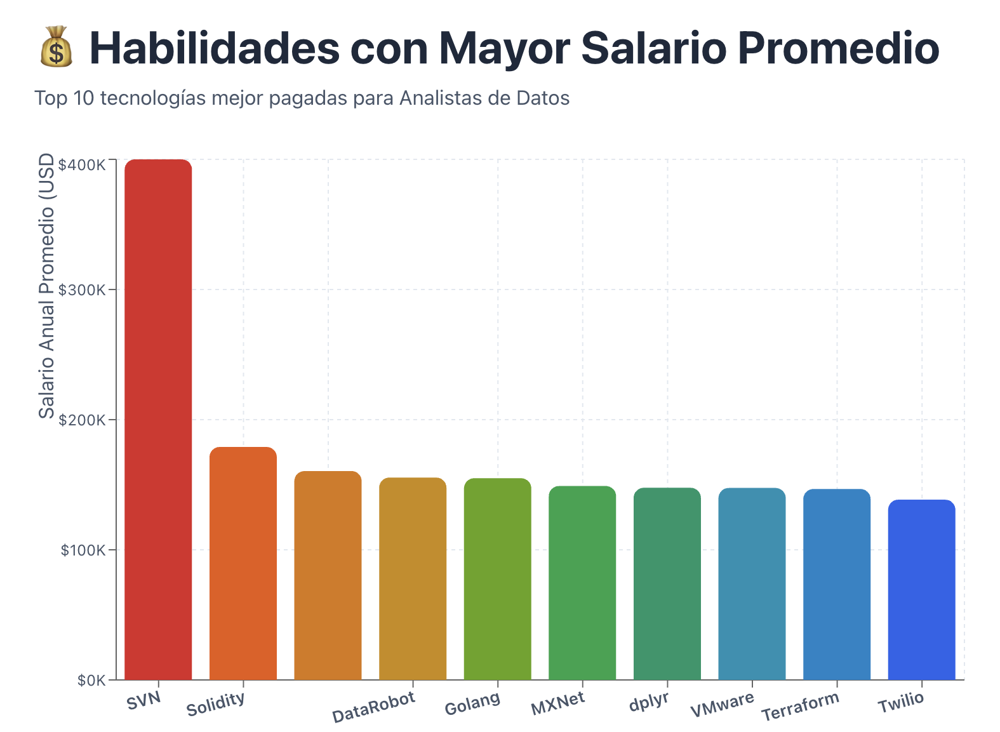
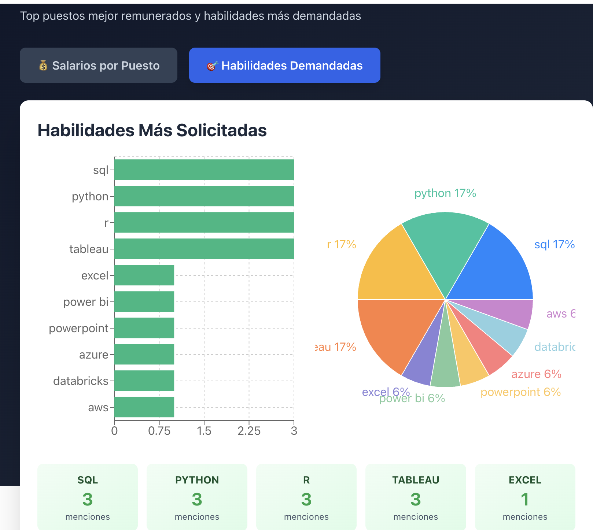

# Introducción
🤓¡Adentrándome en los datos el mercado laboral! Enfocándo en los roles como Data Analyst📊, el proyecto explora los empleos mejor pagados, las habilidades más demandadas que contrastan con análisis de salarios altos.💷

💻Queries en SQL? Dale un vistazo aquí: [proyecto_sql folder](/proyecto_sql/)

## Contexto

Motivada por el deseo de navegar más eficazmente en el mercado laboral de analista de datos, este proyecto surgió con el objetivo de identificar las habilidades mejor remuneradas y más solicitadas, simplificando la búsqueda de empleo óptimo para otros profesionales.

Las preguntas que busqué responder mediante mis consultas SQL fueron:

1. ¿Cuáles son los puestos de analista de datos con mejor remuneración?
2. ¿Qué habilidades se requieren para estos puestos mejor remunerados?
3. ¿Cuáles son las habilidades más demandadas para analistas de datos?
4. ¿Qué habilidades se asocian con salarios más elevados?
5. ¿Cuáles son las habilidades más estratégicas para aprender?

# Herramientas Utilizadas

Para mi análisis profundo del mercado laboral de analista de datos, utilicé varias herramientas fundamentales:

- **SQL:** La base de mi análisis, permitiéndome consultar la base de datos y obtener información crítica.
- **PostgreSQL:** El sistema gestor de bases de datos seleccionado, ideal para gestionar los datos de ofertas laborales.
- **Visual Studio Code**: Mi editor principal para la administración de bases de datos y ejecución de consultas SQL.
- **Git & GitHub**: Esenciales para el control de versiones y compartir mis scripts SQL y análisis, facilitando la colaboración y el seguimiento del proyecto.

# El Análisis

Cada consulta de este proyecto buscó investigar aspectos específicos del mercado laboral de analista de datos. Esta es la forma en que abordé cada pregunta:

### 1. Puestos de Analista de Datos con Mayor Remuneración

Para identificar los roles mejor pagados, filtré las posiciones de analista de datos según el salario promedio anual y la ubicación, con enfoque en empleos remotos. Esta consulta destaca las oportunidades de alta remuneración en el sector.

```sql
SELECT job_id,
    job_title AS NOMBRE_EMPLEO,
    job_location AS UBICACION,
    job_schedule_type AS TIPO_EMPLEO,
    salary_year_avg,
    job_posted_date AS FECHA,
    name AS nombre_empresa
FROM job_postings_fact
    LEFT JOIN company_dim ON job_postings_fact.company_id = company_dim.company_id
WHERE job_title_short = 'Data Analyst'
    AND job_location = 'Anywhere'
    AND salary_year_avg IS NOT NULL
ORDER BY salary_year_avg DESC
LIMIT 10
```
Este es el panorama de los principales trabajos de analista de datos en 2023:

- **Rango Salarial Amplio:** Los 10 roles mejor remunerados de analista de datos oscilan entre $184,000 y $650,000, lo que indica un potencial salarial significativo en este campo.

- **Empleadores Diversos:** Compañías como SmartAsset, Meta y AT&T están entre las que ofrecen salarios altos, demostrando un interés generalizado en distintas industrias.

- **Variedad en Títulos:** Existe una alta diversidad en los títulos de trabajo, desde Analista de Datos hasta Director de Analítica, reflejando roles variados y especializaciones dentro de la analítica de datos.



### 2. Habilidades Mejor Pagadas


*Datos destacados:
🥇 SVN: $400,000 (¡Increíble!)
🥈 Solidity: $179,000
🥉 Couchbase: $160,515
Promedio Top 10: ~$168K*

```sql
WITH top_trabajos_pagados AS (
    SELECT job_id,
        job_title AS NOMBRE_EMPLEO,
        salary_year_avg AS SALARIO,
        job_posted_date AS FECHA,
        name AS nombre_empresa
    FROM job_postings_fact
        LEFT JOIN company_dim ON job_postings_fact.company_id = company_dim.company_id
    WHERE job_title_short = 'Data Analyst'
        AND job_location = 'Anywhere'
        AND salary_year_avg IS NOT NULL
    ORDER BY salary_year_avg DESC
    LIMIT 10
)
SELECT top_trabajos_pagados.*,
    skills AS HABILIDADES
FROM top_trabajos_pagados
    INNER JOIN skills_job_dim ON top_trabajos_pagados.job_id = skills_job_dim.job_id
    INNER JOIN skills_dim ON skills_job_dim.skill_id = skills_dim.skill_id
ORDER BY SALARIO DESC
```

### 3. Habilidades Más Solicitadas

*Los datos muestran:
🥇 SQL: 7,291 menciones
🥈 Excel: 4,611 menciones
🥉 Python: 4,330 menciones
Tableau: 3,745 menciones
Power BI: 2,609 menciones*

| **Habilidad** | **Demanda** |
| --------- | ----------- |
| SQL       | 7291        |
| Excel     | 4611        |
| Python    | 4330        |
| Tableau   | 3745        |
| Power BI  | 2609        |


```sql
SELECT skills,
    COUNT(skills_job_dim.job_id) AS DEMANDA
FROM job_postings_fact
    INNER JOIN skills_job_dim ON job_postings_fact.job_id = skills_job_dim.job_id
    INNER JOIN skills_dim ON skills_job_dim.skill_id = skills_dim.skill_id
WHERE job_title_short = 'Data Analyst'
    AND job_work_from_home = TRUE
GROUP BY skills
ORDER BY DEMANDA DESC
LIMIT 5;
```
### 4. Habilidades Mejor Pagadas

| **Skill** | **Salario Promedio (USD)** |
| --------- | -------------------------- |
| svn       | 400,000                    |
| solidity  | 179,000                    |
| couchbase | 160,515                    |
| datarobot | 155,486                    |
| golang    | 155,000                    |
| mxnet     | 149,000                    |
| dplyr     | 147,633                    |
| vmware    | 147,500                    |

```sql
SELECT skills,
    ROUND(AVG(salary_year_avg), 0) AS SALARIO_PROMEDIO
FROM job_postings_fact
    INNER JOIN skills_job_dim ON job_postings_fact.job_id = skills_job_dim.job_id
    INNER JOIN skills_dim ON skills_job_dim.skill_id = skills_dim.skill_id
WHERE job_title_short = 'Data Analyst'
    AND salary_year_avg IS NOT NULL --AND job_work_from_home = TRUE
GROUP BY skills
ORDER BY SALARIO_PROMEDIO DESC
LIMIT 25;
```

### 5. Habilidades Óptimas

Insights estratégicos:

Python y R combinan demanda masiva con buenos salarios
Cloud (AWS, Azure, Snowflake) ofrece salarios premium
El equilibrio perfecto está en tecnologías con alta demanda Y buen salario

````sql
SELECT skills_dim.skill_id,
    skills_dim.skills,
    COUNT(skills_job_dim.job_id) AS DEMANDA,
    ROUND(AVG(salary_year_avg), 0) AS avg_salary
FROM job_postings_fact
    INNER JOIN skills_job_dim ON job_postings_fact.job_id = skills_job_dim.job_id
    INNER JOIN skills_dim ON skills_job_dim.skill_id = skills_dim.skill_id
WHERE job_title_short = 'Data Analyst'
    AND salary_year_avg IS NOT NULL
    AND job_work_from_home = TRUE
GROUP BY skills_dim.skill_id
HAVING COUNT(skills_job_dim.job_id) > 10
ORDER BY avg_salary DESC,
    DEMANDA DESC
LIMIT 25
```
| Skill         | Demanda  Salario |
| **Snowflake** | 37      | 112,948 | Muy bien pagado y en crecimiento. |
| **Azure**     | 34      | 111,225 | Alta demanda en entornos cloud.   |
| **AWS**       | 32      | 108,317 | Estándar del sector cloud.     
   |
🎯 Conclusiones Principales:
Habilidades más óptimas:

Python - Líder absoluto (236 demanda, $101K)
R - Segunda mejor opción (148 demanda, $100K)
Snowflake - Nicho lucrativo (37 demanda, $113K)

Recomendación final: Dominar Python + Cloud + herramientas de visualización te posiciona en el cuadrante óptimo del mercado.

# 💡 Lo que Aprendí

A lo largo de esta aventura, he potenciado mi arsenal de SQL con poder de fuego.

🛠️ Dominio de Consultas Complejas: Dominar el arte del SQL principiante - avanzado, uniendo tablas y usando cláusulas WITH para maniobras de tablas temporales.

📊 Agregación de Datos: Me familiaricé con GROUP BY y convertí funciones agregadas como COUNT() y AVG() en mis compañeros ideales para resumir datos.

🧠 Magia Analítica: Subí de nivel mis habilidades de resolución de problemas.

🧾 Conclusiones

Este proyecto no solo mejoró mi dominio de SQL, sino que también me brindó una visión profunda del mercado laboral para analistas de datos.

Principales aprendizajes:

El mercado es altamente competitivo, pero lleno de oportunidades.

Las habilidades clave combinan demanda + salario.

La actualización constante es esencial en el campo del análisis de datos.

✨ Este análisis me permitió priorizar mi aprendizaje y orientar mi desarrollo hacia habilidades verdaderamente valiosas para crecer como futura Data Analyst.